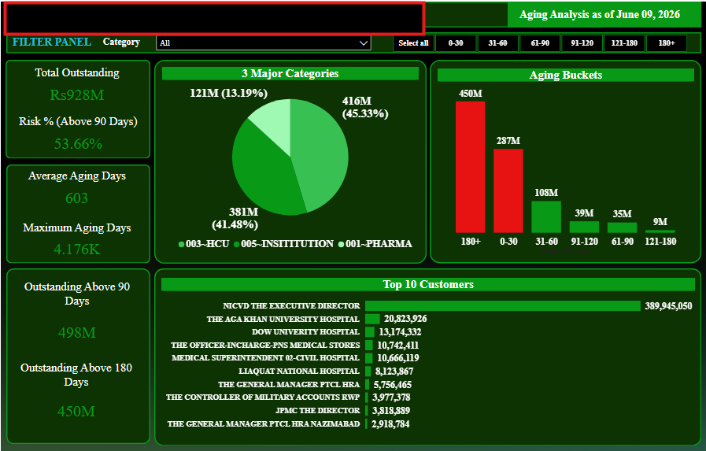

# Aging Analysis Dashboard

## Overview
This Power BI dashboard provides an aging analysis of customer outstanding balances.

## Key Features
- Total Outstanding Analysis
- Risk % Above 90 Days
- Average Aging Days
- Maximum Aging Days
- Aging Bucket Distribution
- Top 10 Customers Analysis
- Category-wise Outstanding Analysis

## Tools Used
- Microsoft Power BI
- DAX
- Power Query
- Data Modeling

## Business Value
The dashboard helps management identify overdue receivables, monitor risk exposure, and prioritize collection efforts.

## Dashboard Preview

