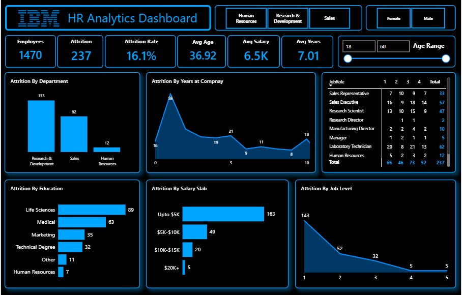

# HR Analytics Dashboard

## Overview

This HR Analytics Dashboard was developed in Microsoft Power BI to analyze employee attrition, workforce demographics, job satisfaction, salary distribution, education fields, and employee tenure.

The dashboard provides an executive-level view of key HR metrics and enables users to explore attrition patterns across different departments, job roles, salary slabs, education fields, and job levels.

## Dashboard Preview

## Key Performance Indicators

* Total Employees
* Total Attrition
* Attrition Rate
* Average Age
* Average Salary
* Average Years at Company

## Dashboard Features

* Attrition by Department
* Attrition by Years at Company
* Job Role and Job Satisfaction Analysis
* Attrition by Education Field
* Attrition by Salary Slab
* Attrition by Job Level
* Age Range Analysis
* Department filtering
* Gender filtering
* Interactive Power BI visuals

## Key Analysis Areas

### Employee Attrition

Analysis of employee attrition across departments and workforce segments to identify areas with higher employee turnover.

### Employee Tenure

Analysis of attrition by years at the company to understand how employee retention varies with tenure.

### Job Satisfaction

Comparison of job roles against job satisfaction levels to identify potential workforce retention patterns.

### Salary Analysis

Analysis of attrition across different salary slabs to understand the relationship between compensation and employee turnover.

### Education Analysis

Analysis of attrition across different education fields to identify workforce patterns.

### Job Level Analysis

Analysis of attrition across different employee job levels.

## Tools & Technologies

* Microsoft Power BI
* Power Query
* DAX
* Data Visualization
* Data Analysis
* Interactive Dashboards
* Business Intelligence

## Interactive Dashboard

[View Interactive Power BI Dashboard](https://app.powerbi.com/view?r=eyJrIjoiNmUwMzBlZjYtYTgyZS00ZGMwLThlNWQtYjdhNDAyYjMwZDVlIiwidCI6IjY4Y2M1ODNmLWU0YWMtNDU0NS05YTAwLTIwZTdiMTQwYjM4MyIsImMiOjl9)

## Project Purpose

This project demonstrates practical skills in HR analytics, data visualization, dashboard development, KPI reporting, interactive filtering, and business intelligence using Microsoft Power BI.

---

**Developed by Farhan Ahmed Siddiqui**
Data Visualization & Business Intelligence Portfolio

